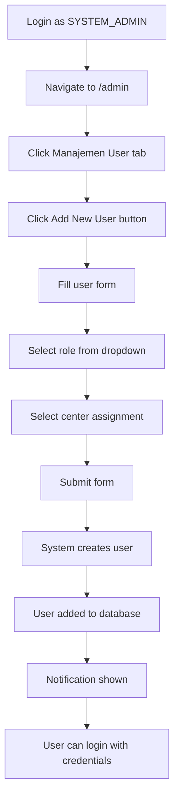

# 👑 SYSTEM ADMIN USER MANAGEMENT GUIDE

## 📋 **Overview**
**YA, SYSTEM_ADMIN (Super Admin) bisa menambahkan user dan mengatur role mereka!**

Sistem INAMSOS dilengkapi dengan **user management interface lengkap** yang hanya dapat diakses oleh user dengan role **SYSTEM_ADMIN** atau **admin/super_admin**.

---

## 🔐 **AKSES USER MANAGEMENT**

### **Required Role:**
- ✅ **SYSTEM_ADMIN** (Super Admin)
- ✅ **admin** (Administrator)
- ✅ **super_admin** (Super Administrator)

### **Access URL:**
- **Admin Page**: `http://localhost:3000/admin`
- **Login Required**: Ya
- **Permission Check**: Automatic role validation

---

## 🎛️ **FITUR USER MANAGEMENT YANG TERSEDIA**

### **1. User Management Tab** 👥
**Lokasi**: `/admin` → Tab "Manajemen User"

#### **✅ Fitur yang Tersedia:**
- **📋 Daftar User**: Lihat semua user yang terdaftar
- **➕ Tambah User Baru**: Create user baru dengan role assignment
- **✏️ Edit User**: Update informasi dan role user existing
- **🗑️ Delete User**: Hapus user (dengan konfirmasi)
- **🔄 Update Status**: Activate/deactivate user accounts
- **📊 User Statistics**: Monitoring user activity dan login

#### **📊 Informasi User yang Ditampilkan:**
```
- Nama Lengkap
- Email Address
- Role/Peran
- Center/Rumah Sakit
- Status (Active/Inactive)
- Last Login Timestamp
- Created Date
- Profile Information
```

### **2. Role Assignment System** 🎭

#### **✅ Roles yang Bisa Di-assign:**
1. **data_entry** - Staff input data
2. **doctor** - Dokter/spesialis medis
3. **nurse** - Perawat
4. **researcher** - Peneliti
5. **admin** - Administrator
6. **super_admin** - Super Administrator
7. **national_stakeholder** - Stakeholder nasional

#### **🔧 Role Management Features:**
- **Assign Role**: Pilih role saat create user
- **Update Role**: Ubah role user existing
- **Role Hierarchy**: Enforced sesuai permissions
- **Permission Control**: Otomatis berdasarkan role assignment

### **3. Center Management** 🏥

#### **✅ Fitur Center Assignment:**
- **Pilih Center**: Assign user ke specific rumah sakit/cancer center
- **Center List**: Daftar semua registered centers
- **Multi-Center Support**: User bisa di-assign ke multiple centers
- **Center-based Access**: User hanya akses data center mereka

---

## 🛠️ **CARA MENAMBAHKAN USER BARU**

### **Step-by-Step Guide:**

#### **1. Login sebagai SYSTEM_ADMIN**
```bash
URL: http://localhost:3000/login
Email: admin@inamsos.go.id
Password: AdminInamsos123!
```

#### **2. Navigasi ke Admin Page**
```bash
Setelah login → Navigate ke: http://localhost:3000/admin
Atau klik menu "Administrasi" di sidebar
```

#### **3. Buka User Management**
- Klik tab "Manajemen User" (👥 icon)
- atau scroll ke user management section

#### **4. Tambah User Baru**
- Klik tombol **"Add New User"** (biru)
- Modal form akan muncul

#### **5. Isi User Data**
```typescript
// Form fields yang tersedia:
{
  name: "Nama Lengkap User",           // Required
  email: "user@example.com",          // Required, unique
  password: "SecurePassword123!",     // Required, min 6 chars
  role: "doctor",                    // Required, pilih dari dropdown
  centerId: "center-001",            // Required, pilih dari dropdown
  phone: "+628123456789",            // Optional
  nik: "1234567890123456",           // Optional (NIK)
  kolegiumId: "KOL-001",            // Optional (ID Kolegium)
}
```

#### **6. Submit & Konfirmasi**
- Review data user
- Klik "Create User"
- Success notification akan muncul

---

## 📊 **USER MANAGEMENT INTERFACE**

### **Admin Page Structure:**
```
System Administration
├── Dashboard (🎛️)
├── Manajemen User (👥) ← USER MANAGEMENT
├── Pusat Layanan (🏥)
├── Pengaturan (⚙️)
├── Audit Log (📋)
└── Backup & Restore (💾)
```

### **User Management Table:**
```typescript
// Kolom yang ditampilkan:
┌─────────────────┬─────────────┬─────────────┬─────────────┬──────────────┐
│ User            │ Email       │ Role        │ Center      │ Status       │
├─────────────────┼─────────────┼─────────────┼─────────────┼──────────────┤
│ Dr. Sarah Wijaya │ sarah@rscm  │ doctor      │ RSCM        │ ✅ Active     │
│ Dr. Budi Santoso │ budi@rsup   │ doctor      │ RSUP Dr.S   │ ✅ Active     │
│ Nur Hidayah     │ nur@rs     │ nurse       │ RS Kariadi  │ ✅ Active     │
└─────────────────┴─────────────┴─────────────┴─────────────┴──────────────┘
```

---

## 🔒 **SECURITY & PERMISSIONS**

### **Role-based Access Control (RBAC):**
```typescript
// Permission checks di backend:
@Roles('SYSTEM_ADMIN', 'admin', 'super_admin')
@Controller('users')
export class UsersController {
  // User CRUD operations hanya untuk admin roles
}

// Frontend role validation:
if (user?.role !== 'admin' && user?.role !== 'super_admin') {
  window.location.href = '/dashboard';  // Redirect non-admin users
}
```

### **Security Features:**
- ✅ **Authentication Check**: Hanya user terautentikasi
- ✅ **Role Validation**: Automatic role checking
- ✅ **Permission Enforcement**: RBAC di backend & frontend
- ✅ **Audit Logging**: Semua user management activities logged
- ✅ **Input Validation**: Form validation & sanitization
- ✅ **Duplicate Prevention**: Email uniqueness check

---

## 🛠️ **TECHNICAL IMPLEMENTATION**

### **Backend API Endpoints:**
```typescript
// User Management endpoints (SYSTEM_ADMIN only):
POST   /api/v1/users              // Create new user
GET    /api/v1/users              // Get all users
GET    /api/v1/users/:id           // Get user by ID
PUT    /api/v1/users/:id           // Update user
DELETE /api/v1/users/:id           // Delete user
PATCH  /api/v1/users/:id/status    // Update user status

// Role Management endpoints:
GET    /api/v1/roles               // Get all roles
POST   /api/v1/roles               // Create new role
PUT    /api/v1/roles/:id           // Update role
DELETE /api/v1/roles/:id           // Delete role
```

### **Frontend Implementation:**
```typescript
// Admin page component dengan role check:
const AdminPage = () => {
  const { user } = useAuth();

  // Role validation
  if (user?.role !== 'admin' && user?.role !== 'super_admin') {
    return <AccessDenied />;
  }

  // User management state
  const [users, setUsers] = useState([]);
  const [showUserModal, setShowUserModal] = useState(false);

  // Add new user function
  const handleAddUser = async (userData) => {
    const response = await api.post('/users', userData);
    setUsers([...users, response.data]);
  };

  return (
    // User management UI
  );
};
```

---

## 📝 **API EXAMPLES**

### **Create New User API Call:**
```bash
# Sebagai SYSTEM_ADMIN, create user baru
curl -X POST http://localhost:8888/api/v1/users \
  -H "Authorization: Bearer SYSTEM_ADMIN_TOKEN" \
  -H "Content-Type: application/json" \
  -d '{
    "name": "Dr. John Doe",
    "email": "john.doe@hospital.id",
    "password": "SecurePass123!",
    "role": "doctor",
    "centerId": "center-002",
    "phone": "+628123456789"
  }'
```

### **Update User Role API Call:**
```bash
# Update role user existing
curl -X PUT http://localhost:8888/api/v1/users/user-123 \
  -H "Authorization: Bearer SYSTEM_ADMIN_TOKEN" \
  -H "Content-Type: application/json" \
  -d '{
    "role": "researcher",
    "centerId": "center-004"
  }'
```

---

## 🎯 **USER CREATION WORKFLOW**

### **Complete Workflow:**


### **Data Flow:**
1. **SYSTEM_ADMIN login** → JWT token dengan SYSTEM_ADMIN role
2. **Access /admin** → Frontend role validation
3. **Create user form** → Frontend validation
4. **API call** → Backend @Roles('SYSTEM_ADMIN') validation
5. **Database operation** → User created dengan role assignment
6. **Response** → Success notification
7. **User login** → New user dapat akses sesuai role

---

## 🔧 **MANAGEMENT CAPABILITIES**

### **✅ What SYSTEM_ADMIN Can Do:**
1. **User Creation**: Add unlimited users
2. **Role Assignment**: Assign any role to any user
3. **Permission Control**: Manage access levels
4. **Center Assignment**: Assign users to specific centers
5. **Status Management**: Activate/deactivate accounts
6. **Profile Updates**: Edit user information
7. **Password Reset**: Reset user passwords
8. **Audit Monitoring**: Track all user activities
9. **Bulk Operations**: Manage multiple users simultaneously

### **🚫 What SYSTEM_ADMIN Cannot Do:**
- Delete themselves (self-protection)
- Assign role higher than SYSTEM_ADMIN
- Access user data without proper authorization
- Bypass security measures
- Modify core system configurations without proper process

---

## 📊 **USER STATISTICS & MONITORING**

### **Available Metrics:**
- **Total Users**: Jumlah total user terdaftar
- **Active Users**: User yang login dalam 30 hari terakhir
- **Users by Role**: Distribusi user per role
- **Users by Center**: Distribusi user per center
- **Login Activity**: Track login frequency dan patterns
- **Account Status**: Active vs inactive accounts
- **New Registrations**: User registration trends

### **Dashboard Metrics:**
```typescript
interface UserStats {
  totalUsers: number;
  activeUsers: number;
  usersByRole: {
    doctor: number;
    nurse: number;
    researcher: number;
    admin: number;
    // ... other roles
  };
  usersByCenter: {
    [centerId: string]: number;
  };
  recentLogins: Array<{
    userId: string;
    loginTime: Date;
    ipAddress: string;
  }>;
}
```

---

## 🎉 **SUMMARY: JAWABAN LENGKAP**

### **✅ YA, SYSTEM_ADMIN BISA:**

1. **👥 Menambah User Baru**
   - Form lengkap untuk user creation
   - Automatic role assignment
   - Center assignment
   - Email notification

2. **🎭 Mengatur Role User**
   - Assign role saat creation
   - Update role existing users
   - Role hierarchy enforcement
   - Permission inheritance

3. **⚙️ Manajemen User Lengkap**
   - Edit user profiles
   - Activate/deactivate accounts
   - Reset passwords
   - Monitor user activity
   - Generate user reports

4. **🏥 Center Management**
   - Assign users ke specific centers
   - Multi-center support
   - Center-based access control

### **🛡️ Keamanan Terjamin:**
- Hanya SYSTEM_ADMIN yang bisa akses
- Automatic role validation
- Audit logging untuk semua operasi
- Input validation dan sanitization
- Permission enforcement di backend dan frontend

### **📍 Cara Akses:**
1. Login sebagai: `admin@inamsos.go.id`
2. Password: `AdminInamsos123!`
3. Navigate to: `http://localhost:3000/admin`
4. Click tab: "Manajemen User" (👥)
5. Click: "Add New User" button

**SYSTEM ADMIN memiliki kontrol penuh atas user management di sistem INAMSOS!** 🎉

---

*Last Updated: November 20, 2025*
*System Version: INAMSOS v1.0*